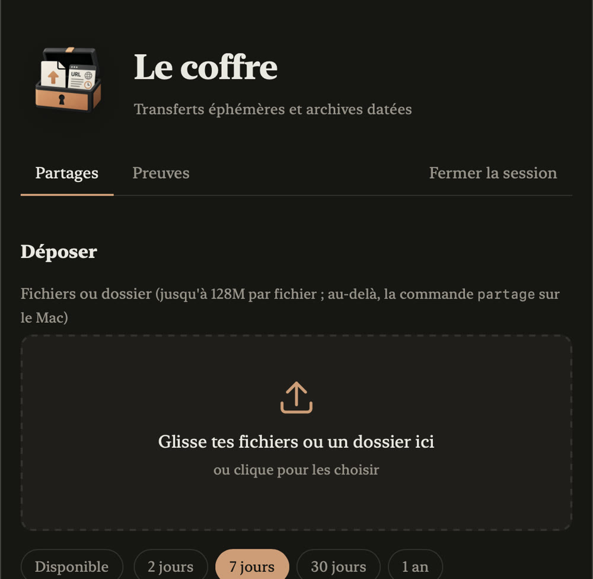

<p align="center"></p>

# Le coffre


Deux outils sur un même socle, à poser sur n'importe quel hébergement PHP, même le plus modeste :

- **un dépôt de fichiers** — un WeTransfer à soi. On envoie un fichier ou un dossier entier, sans limite de taille, on obtient un lien imprévisible à coller dans un message. Le destinataire n'a ni compte à créer ni mot de passe à taper. À l'échéance, tout est réellement effacé.
- **un conservatoire de preuves** — des captures de pages web datées, empreintées et chaînées. Chaque pièce (image, PDF, code source, en-têtes) porte son empreinte SHA-256, et chaque dépôt est chaîné au précédent : retoucher une capture ancienne casserait toutes les suivantes, ce qui se voit immédiatement.

Créé par **[Tristan Mendès France](https://tristan.pro)**, qui travaille sur la désinformation et avait besoin des deux : envoyer des rushes lourds à des confrères, et garder des traces de pages qui disparaissent. **Point important : je ne suis pas développeur.** Je n'ai pas écrit ce code à la main : je l'ai décrit à une IA ([Claude Code](https://claude.com/claude-code)), qui l'a écrit, testé et corrigé au fil de mes retours. Ce dépôt est autant un outil qu'une démonstration : on peut se fabriquer ce qui manque en le racontant.

<p align="center"></p>

*La page d'administration : on glisse un fichier ou un dossier, on choisit la durée de vie, le lien apparaît.*

## Ce que ça fait

**Depuis le Mac**, deux commandes :

```bash
partage ~/Movies/rushes.mp4 -j 30 -n "montage de mardi"
partage ~/Movies/Tunisie/                 # un dossier entier, sous-dossiers compris
preuve https://exemple.fr/le-post -n "narratif repris par X le 19 août"
```

`partage` envoie en SFTP (aucune limite de taille, transfert reprenable), affiche le lien et le copie dans le presse-papier. `preuve` capture la page avec Chrome (image, PDF de la page entière, code HTML, en-têtes du serveur), empreinte chaque pièce, envoie le tout et l'inscrit au registre. Une copie de chaque pièce reste sur le Mac, dans `~/.local/share/coffre` (ou le dossier indiqué par `COFFRE_LOCAL=` dans `~/.config/coffre/config`).

**Depuis le navigateur**, une page d'administration sous mot de passe : on y dépose des fichiers ou un dossier par glisser-déposer, on choisit la durée de vie (2 jours à 1 an), on obtient le lien. On y consulte le conservatoire, on y cherche, on y vérifie que chaque pièce correspond encore à ses empreintes.

**Pour le destinataire**, une page sobre : le nom, la taille, la date d'expiration, un bouton, et l'empreinte SHA-256 pour vérifier que ce qu'il a reçu est bien ce qu'on a envoyé. Pour un dossier : la liste des fichiers, chacun téléchargeable séparément.

## Ce qu'il faut

Côté serveur : **PHP 8.1 ou plus, Apache avec `.htaccess` actif** (`mod_rewrite`, `mod_headers`), un accès **SFTP**. Un hébergement mutualisé à quelques euros suffit — c'est là que ça tourne chez moi. Pas de base de données : tout tient dans deux fichiers JSON.

Côté Mac, pour les commandes : `lftp` (`brew install lftp`), `python3`, `php` en ligne de commande (`brew install php`, seulement pour la préparation), et Google Chrome pour `preuve`.

## Installation

```bash
git clone https://github.com/tristanmf/coffre.git
cd coffre
```

1. **L'accès SFTP.** Copier `bin/ovhftp` dans `~/.local/bin`, créer `~/.config/ovhftp/config` avec trois lignes (`FTP_HOST=…`, `FTP_USER=…`, `FTP_BASE=/chemin/racine`), puis `ovhftp setup` : le mot de passe part dans le trousseau macOS, jamais sur le disque. Malgré son nom, `ovhftp` parle à n'importe quel serveur SFTP.
2. **La configuration du coffre.** `bin/coffre-preparer` demande l'adresse publique du coffre, le dossier distant, un mot de passe (tapé deux fois, sans écho), et fabrique `depot/coffre/config.php` avec l'empreinte bcrypt du mot de passe et une clé tirée au hasard. Rien de secret n'est affiché ni écrit dans l'historique.
3. **L'envoi sur le serveur.** `ovhftp push depot www/depot` (adapter le dossier distant). Puis vérifier dans un navigateur que `https://votre-adresse/depot/coffre/` renvoie bien **403** : si ce n'est pas le cas, le serveur ignore les `.htaccess`, et il ne faut pas aller plus loin.
4. **Les commandes.** `bin/coffre-installer` les copie dans `~/.local/bin`, vérifie le mot de passe auprès du serveur et le range dans le trousseau. Sur un second Mac, seule cette étape est nécessaire : aucun secret à transporter, on retape simplement le mot de passe.

## Ce qu'il faut savoir avant de s'en servir

- **Les liens de partage sont publics mais imprévisibles** : 24 caractères tirés au hasard, de quoi rendre toute recherche systématique inutile. Quiconque a le lien peut télécharger. C'est le principe, et c'est la limite.
- **Ce n'est pas un outil pour protéger une source.** Un hébergement mutualisé n'offre ni l'anonymat ni les garanties d'un SecureDrop. Pour des rushes, des documents de travail, des fichiers lourds entre collègues : parfait. Pour protéger quelqu'un : non.
- **Le conservatoire est privé.** Rien n'en sort sans mot de passe, ni les captures ni les fiches. C'est volontaire : republier du contenu problématique sur son propre hébergement, c'est s'attirer des ennuis pour rien.
- **La capture se fait déconnecté**, dans un profil Chrome vierge. Une page réservée aux membres, ou un contenu que le réseau n'affiche qu'aux connectés, ne sera pas capturé. C'est aussi ce qui garantit qu'aucun cookie personnel ne se retrouve dans les pièces. Une capture faite autrement se classe avec `preuve URL --depuis dossier/`.
- **Retirer une pièce efface ses fichiers mais garde sa fiche**, marquée « retirée le… » avec son motif et ses empreintes. La chaîne tient, puisqu'elle repose sur les empreintes du jour de la capture. Un retrait se constate donc toujours : une archive qu'on peut vider en silence ne vaut rien.
- **Le ménage se fait au passage.** Les partages expirés sont effacés dès que quelqu'un ouvre la page d'administration ou un lien de retrait. Si le coffre reste inutilisé des mois, une tâche planifiée qui appelle `index.php` une fois par jour suffit — c'est facultatif.
- **Le frein anti-essais est global, pas par adresse IP** : quelqu'un qui martèle la page de connexion la ferme pour tout le monde pendant un quart d'heure, vous compris. Sur un outil personnel c'est le bon compromis ; sur un outil partagé, ce serait à revoir.

## Comment c'est fait

```
depot/
  index.php          la page d'administration (les deux onglets)
  vue-partages.php   l'onglet des partages, dépôt par glisser-déposer compris
  vue-preuves.php    l'onglet du conservatoire
  d.php              la page de retrait, celle qu'on envoie aux gens
  v.php              sert les pièces du conservatoire, session obligatoire
  televerse.php      reçoit les fichiers du navigateur, un par requête
  api.php            reçoit les inscriptions envoyées par les commandes du Mac
  lib.php            le socle commun
  .htaccess          lien court /depot/d/JETON, interdiction de lire les JSON
  coffre/            configuration, registres, captures — jamais servi par Apache
  f/                 les fichiers partagés, servis directement par Apache
bin/
  coffre-preparer    fabrique la configuration (une fois)
  coffre-installer   installe les commandes sur un Mac
  partage            envoie et donne le lien
  preuve             capture une page et l'archive
  ovhftp             l'accès SFTP, mot de passe dans le trousseau
```

Quelques choix, pour qui voudrait adapter :

- **Apache sert les fichiers lui-même.** Faire passer 3 Go par PHP sur un mutualisé, c'est se heurter aux limites de mémoire et de temps. Les fichiers vivent donc dans un dossier public sous un nom imprévisible ; PHP ne s'occupe que de la page du lien, du décompte et de l'effacement. C'est le compromis que fait WeTransfer.
- **Rien d'exécutable dans le dossier public** : les noms de fichiers sont assainis, les extensions de scripts reçoivent un `.txt`, le `.htaccess` du dossier interdit PHP quoi qu'il arrive, et les pages HTML ou SVG partagées se téléchargent au lieu de s'ouvrir dans le navigateur.
- **Le mot de passe n'existe nulle part en clair** : seule son empreinte bcrypt vit dans la configuration. Les essais sont comptés sous verrou exclusif avant même la vérification, ce qui empêche de glisser plusieurs tentatives en parallèle sous le compteur. Session régénérée à la connexion, cookie cantonné au dossier du coffre, jeton CSRF sur chaque formulaire.
- **Les commandes du Mac n'ont pas de secret à transporter** : l'API accepte le mot de passe de la page autant que la clé. Sur une nouvelle machine, on le retape, et il part au trousseau.
- **Le pare-feu d'un mutualisé filtre la forme des requêtes.** Chez OVH, un POST sans `User-Agent` de navigateur, sans `Content-Type: application/json` ou avec un corps vide reçoit un 403 sans explication. Les commandes s'en souviennent pour vous.

## Licence

MIT. Fait par Tristan Mendès France avec Claude Code. Les retours et améliorations sont bienvenus dans les issues.

---

### In English

A self-hosted file drop (a personal WeTransfer: unlimited size over SFTP, unguessable links, real deletion on expiry) plus an evidence vault (web pages captured as screenshot, full-page PDF, HTML and headers, each SHA-256 hashed and chained to the previous entry, so any later tampering shows). Plain PHP, no database, runs on cheap shared hosting; two Mac commands, `partage` and `preuve`. Not designed to protect sources. Written by describing it to Claude Code — the author is not a developer. MIT licensed.
